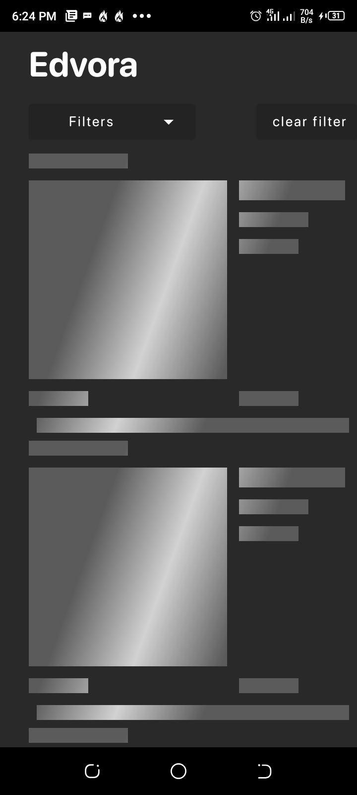
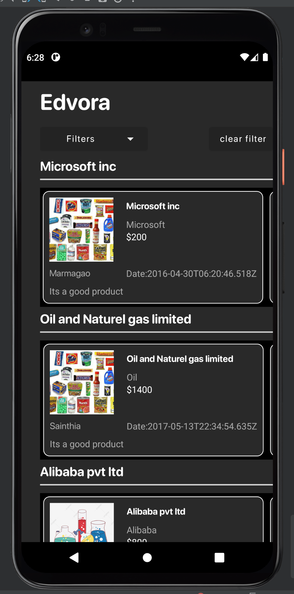

# Edvora-Assessment

## Development

This simple app displays a list of products, the brand and the name of the Company it belongs to. The app is developed following MVVM architecture and Below are some of the technologies that was used. 

- [Dagger Hilt](https://dagger.dev/hilt/)
- [Jetpack DataBinding](https://developer.android.com/topic/libraries/data-binding)
- [Kotlin State Flow](https://developer.android.com/kotlin/flow/stateflow-and-sharedflow)
- [JetPack Navigation Components](https://developer.android.com/guide/navigation/navigation-getting-started)
- [Kotlin](https://kotlinlang.org/) + [Kotlin Coroutines](https://kotlinlang.org/docs/reference/coroutines-overview.html)
- [FaceBook Shimmer Recyclerview](https://facebook.github.io/shimmer-android/)
- [Coil](https://github.com/coil-kt/coil)
- And more

